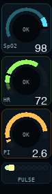

# BLE Health Hub

Reverse-engineering notes and tooling for BLE health devices.

## ESP32 display demos

| GK+ | Pulse Ox |
|:---:|:--------:|
|  |  |

## Device docs

- Pulse oximeter (PO3): [PULSE_OX_README.markdown](PULSE_OX_README.markdown)
- GK+ (reverse engineering notes): [GK+_README.markdown](GK+_README.markdown)

## Key files

- Historical notes / reproduction steps: [HANDOFF.markdown](HANDOFF.markdown)
- PCAP captures: `data/`
- Analysis scripts: `tools/`
- Web Bluetooth demo app: `web/`

## Web Bluetooth demo

Web Bluetooth requires a secure context; localhost is easiest.

```sh
cd web
python3 -m http.server 8000
```

Open `http://localhost:8000` in Chrome/Edge, click **Connect**, and select the device.

## Vendor APK note (MyVitals)

This repo may reference vendor APK behavior during reverse engineering.

- Don’t commit third-party APKs to git.
- If you’re allowed to share it with collaborators, prefer a GitHub Release asset + SHA256 hash.

```sh
shasum -a 256 "iHealth MyVitals_4.13.1_APKPure.apk"
```
