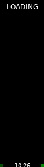

# ESP32 app (PlatformIO)

Goal: a standalone ESP32 app that shows GK+ + pulse-ox values on a **76x284 TFT** (via **TFT_eSPI**) and later talks BLE to the devices.



## Status

- Current milestone: **display bring-up + animation** (full-screen Lottie playback)
- GK+ BLE auto-connect + latest-reading download is working (connects to a fixed meter MAC).
- Demo/test screens are gated behind a strap: **GPIO5 to GND enables demo mode**; if not grounded, the firmware shows **LOADING only**.

### GK+ MAC address

Right now the firmware connects directly to a specific GK+ meter by MAC address.

- Configure it in `esp32/src/main.cpp` as `kGkPlusMac`.
- The code will try the MAC as both "random" and "public" address types (some units use a stable address but advertise it as random).

## Prereqs

- VS Code + PlatformIO extension
- ESP32 toolchain installed via PlatformIO

## Build / Upload

From the repo root:

```sh
cd esp32
./pio run -e esp32-s3-n16r8
./pio run -e esp32-s3-n16r8 -t upload
./pio device monitor
```

If you prefer not to use the wrapper, use the default PlatformIO venv install path:

```sh
~/.platformio/penv/bin/pio run -e esp32-s3-n16r8
```

## Lottie animation (RLottie)

We play a full-screen (76x284) Lottie animation using **RLottie**.

### Asset location

- Put the dotLottie file at: `esp32/assets/flame.lottie`

### Build-time JSON extraction

`.lottie` is a zip container. We extract the first animation JSON during the PlatformIO build and generate a header:

- Script: `esp32/scripts/gen_flame_lottie_header.py`
- Output (generated): `esp32/src/generated/flame_lottie.h`

The generated directory is ignored in git (it is recreated during build).

### Vendored RLottie

RLottie is vendored under:

- `esp32/lib/rlottie`

### RLottie patch (layer `TrOpacity` support)

We intentionally carry a *tiny* patch against vendored RLottie.

**Why this patch exists**

Our demo mode needs to show/hide named Lottie layers at runtime (e.g. show only `Logs` in NOT KETOSIS, hide `RedWhips Outline Container` in MID KETOSIS).

RLottie exposes a public API for this kind of thing:

- `Animation::setValue<rlottie::Property::TrOpacity>("**.<LayerName>", pct)`

However, in the RLottie code we vendored, layer-level transform property updates were effectively a no-op: `renderer::Layer::resolveKeyPath()` matched the keypath but contained a `//@TODO handle propery update.` and did not store/apply the value.

That meant our app code could call `setValue(TrOpacity, ...)` without any visible effect.

**What the patch changes**

The patch wires the existing filter mechanism into `renderer::Layer`:

- When a keypath fully resolves to a layer name and the property is a transform property (`TrOpacity`), RLottie stores the value in per-layer filter data.
- `renderer::Layer::opacity()` consults that filter data if present.

This keeps the behavior local to layer opacity and avoids broader changes.

**Patch file**

- `esp32/patches/rlottie-layer-tropacity.patch`

**How to re-apply after upgrading RLottie**

From repo root (after replacing `esp32/lib/rlottie` with a newer version):

```sh
git apply esp32/patches/rlottie-layer-tropacity.patch
```

If it fails to apply cleanly, the upstream RLottie code likely changed around the patched functions. Rebase the patch by making the equivalent edits, then regenerate the patch.

This lets us control compilation for ESP32 (Xtensa):

- Force a modern C++ standard for RLottie sources via `esp32/lib/rlottie/library.json` (`-std=gnu++17`)
- Exclude non-ESP32 sources (e.g. `wasm/*`, ARM NEON assembly)
- Avoid `<dlfcn.h>` by compiling the non-plugin image loader path

### Runtime rendering strategy

- Render frames to an ARGB8888 buffer (prefer PSRAM)
- Convert to RGB565
- Push the full 76x284 frame via TFT_eSPI each tick

## Display configuration

Edit:

- `esp32/include/User_Setup.h`

You must set:

- correct TFT driver (`ST7789_DRIVER` vs other)
- correct SPI pins (`TFT_MOSI`, `TFT_SCLK`, `TFT_CS`, `TFT_DC`, `TFT_RST`, `TFT_BL`)
- correct `TFT_WIDTH` / `TFT_HEIGHT`

On boot, the firmware shows a quick RGB flash + color bars (test pattern), then a boot screen and sample dashboard. Use that to debug whether you have “backlight only” vs “SPI/driver is wrong”.

Driver note: if your module reports **ST7789P3**, it is typically compatible with TFT_eSPI's `ST7789_DRIVER`.

If the image is shifted/cropped, the panel likely needs ST7789 offsets (TFT_eSPI supports offsets in some setups) — we’ll add those once we know what the panel is doing.

### Recommended wiring (LB ESP32-S3 N16R8 board)

These match the defaults in `esp32/include/User_Setup.h`:

- Display `SDA` → `GPIO11` (MOSI)
- Display `SCL` → `GPIO12` (SCLK)
- Display `CS` → `GPIO10` (or set `TFT_CS=-1` if your breakout truly omits CS)
- Display `DC` → `GPIO9`
- Display `RST` → `GPIO14`
- Display `BL` → `GPIO15` (optional; some breakouts tie backlight high)
- Display `VCC` → `3V3`
- Display `GND` → `GND`

Demo gate strap:

- `GPIO5` → `GND` (optional) to enable the demo loop; leave unconnected for normal boot (LOADING only).

## Known-good TFT config (76x284 narrow panel)

As of 2026-03-14, the display is working reliably with a **logical 240x320 ST7789 canvas** and an explicit **76x284 viewport**.

Why this matters:

- The physical visible area is **76x284**, but many ST7789-based modules are a *cropped window* into the controller’s **240x320 GRAM**.
- When we configured TFT_eSPI as **240x280**, the firmware could never write the last ~4 physical rows, which showed up as **weird stale rectangles at the bottom**.

### 1) TFT_eSPI setup (`include/User_Setup.h`)

Key points:

- Use `ST7789_DRIVER`
- Use `TFT_WIDTH=240`, `TFT_HEIGHT=320`
- Do **not** use `CGRAM_OFFSET` for this panel (we handle the visible window via `setViewport()`)
- ESP32-S3: provide a dummy `TFT_MISO` pin (even if the display is write-only) to avoid SPI init edge cases

Current working defaults are in `esp32/include/User_Setup.h`.

### 2) Firmware viewport (`src/main.cpp`)

We render into the visible slice by setting a viewport on each draw:

- `kPanelW = 76`
- `kPanelH = 284`
- `kPanelXOff = 82` (horizontal alignment within the 240-wide canvas)
- `kPanelYOff = 18` (centers 284 within 320: `(320-284)/2`)

If anything is shifted, tune these:

- If content is shifted left/right: adjust `kPanelXOff`
- If the top/bottom are clipped: adjust `kPanelYOff` by small steps (e.g. `16`, `18`, `20`)

Important:

- Avoid using negative `tft.setOrigin()` shifts for alignment on this setup; it caused text to disappear due to clipping interactions. The stable method is `setViewport(x, y, w, h, ...)`.

### 3) ESP32-S3 SPI bring-up note

To avoid rare crashes during display init on ESP32-S3, the firmware explicitly initializes the SPI peripheral before `tft.init()`:

```cpp
TFT_eSPI::getSPIinstance().begin(TFT_SCLK, TFT_MISO, TFT_MOSI, (TFT_CS >= 0) ? TFT_CS : -1);
```

If you remove that line and see boot-time instability, put it back.

## Next

## MyMojoHealth (Keto-Mojo) API sync (planned)

Goal: after we download the latest GK+ readings (GLU/KET/GKI), upload them to the user’s MyMojoHealth cloud account.

Docs:

- https://keto-mojo.github.io/MyMojoHealth-public-docs/
- https://api.us.mymojohealth.com/docs

Scope: planning + documentation only (no firmware implementation yet).

### What we will build

We’ll add a small “cloud sync” control surface to the existing WiFiManager portal:

- `Connect MyMojoHealth` (starts OAuth consent)
- `Disconnect MyMojoHealth` (revokes + clears tokens)
- `Sync now` (manual upload)
- `Status` (connected/disconnected + last upload result)

### User permission (how we get consent)

MyMojoHealth uses **OAuth 2.0 with PKCE**.

The user-consent flow will be:

1) User joins the ESP32’s WiFiManager SoftAP (config portal) and opens the portal UI.
2) User clicks `Connect MyMojoHealth`.
3) ESP32 generates PKCE values:

- `code_verifier` (random string)
- `code_challenge = base64url(sha256(code_verifier))`

4) ESP32 redirects the phone browser to the MyMojoHealth authorize endpoint:

- `https://auth.us.mymojohealth.com/oauth/authorize`

With query params:

- `response_type=code`
- `client_id=<client_id>`
- `code_challenge_method=S256`
- `code_challenge=<code_challenge>`
- `scope=readings_create`
- `redirect_uri=http://192.168.4.1/oauth/callback`

5) The user logs in and is shown MyMojoHealth’s consent screen.

This is the explicit permission step: the OAuth client configuration includes our **Terms of Service URL** and **Privacy Policy URL**, which MyMojoHealth presents on that screen.

6) After approval, MyMojoHealth redirects back to our `redirect_uri` with `code=...`.
7) ESP32 exchanges the authorization code for tokens.

### Why this redirect URI strategy (ESP32-only)

OAuth redirect URIs must be pre-registered. For an ESP32, the most reliable ESP-only option is to run the connect/consent flow while the phone is on the ESP32 SoftAP, because the portal IP is stable:

- `http://192.168.4.1/oauth/callback`

If we later want “connect” while the ESP32 is on the home LAN, we can add an additional redirect URI (still ESP-only) such as `http://ble-health-hub.local/oauth/callback` (mDNS), but the initial plan avoids that dependency.

### OAuth client setup (developer steps)

For sandbox testing:

- Create a Sandbox Partner account and OAuth client: https://auth.staging.mymojohealth.com/partners/register
- Enable scopes in the Partner Dashboard (minimum: `readings_create`).

OAuth client settings we expect to use:

- Grant types: `authorization_code`, `refresh_token`
- Token endpoint auth method: `none` (public client) so the ESP32 doesn’t store a client secret
- Redirect URIs: include `http://192.168.4.1/oauth/callback`
- ToS URL + Privacy Policy URL: required for a user-facing consent experience

### Token exchange / refresh / revoke

Token endpoint (per docs): `POST /api/v1/oauth/token`.

Important doc note: payload is **multipart/form-data** (not raw JSON).

Initial exchange (authorization code):

- `grant_type=authorization_code`
- `client_id=<client_id>`
- `redirect_uri=<redirect_uri>`
- `scope=<scope>`
- `code=<authorization_code>`
- `code_verifier=<code_verifier>`

Refresh:

- `grant_type=refresh_token`
- `refresh_token=<refresh_token>`
- `client_id=<client_id>`
- `scope=<scope>`

Revoke (disconnect):

- `POST /api/v1/oauth/revoke` then clear stored tokens

Storage plan:

- Persist only the `refresh_token` in NVS.
- Keep `access_token` in RAM and refresh when needed.

### Uploading readings

We will upload via:

- `POST https://api.us.mymojohealth.com/api/v1/readings`
- `Authorization: Bearer <access_token>`

Request body is a JSON array of readings. For each GK+ sync we plan to send:

- Glucose
	- `reading_type`: `glucose`
	- `reading_unit`: `mgdl`
	- `reading_sample_type`: `blood`
	- `reading_value`: integer string (e.g. `"92"`)
	- `source`: `device`
	- `meter_type`: `gk+_meter`

- Ketone
	- `reading_type`: `ketone`
	- `reading_unit`: `mmoll`
	- `reading_sample_type`: `blood`
	- `reading_value`: one-decimal string (e.g. `"0.2"`)
	- `source`: `device`
	- `meter_type`: `gk+_meter`

- Optional: GKI (computed by this project)
	- `reading_type`: `glucose_ketone_index`
	- `reading_unit`: empty string (allowed by schema)
	- `reading_value`: one-decimal string (e.g. `"25.5"`)
	- `source`: `device_calculated_gki`
	- `has_device_calculated_gki`: `true`
	- `meter_type`: `gk+_meter`

Common fields we’ll include:

- `reading_timestamp`: ISO 8601 timestamp for the GK+ reading
- `client_updated_at`: ISO 8601 timestamp when we upload
- `device_id`: ESP32 identifier (e.g. Wi-Fi MAC)
- `serial_number`: GK+ serial if/when we can read it reliably (optional)

Server behavior note: duplicates are detected server-side (user + timestamp + type + value + serial number).

### Basic sync behavior

- On each “new readings downloaded” event, attempt upload.
- If Wi-Fi is down, queue for later.
- If the token is expired, refresh and retry.

### Privacy expectations

- No upload happens without explicit OAuth consent.
- Provide a one-click `Disconnect` to revoke + wipe tokens.
- Keep scopes minimal (`readings_create` only to start).

## Troubleshooting (common)

- Blank screen but ESP32 is running:
	- Try flipping backlight polarity in `esp32/include/User_Setup.h`:
		- `#define TFT_BL_ON LOW`
	- If your breakout has no CS pin (or it is not connected), set `TFT_CS` to `-1`.
	- Drop SPI speed: set `SPI_FREQUENCY` to `27000000` or `20000000`.
- Image shows but is shifted/cropped:
	- This panel likely needs ST7789 RAM offsets; capture a photo of what you see and we’ll add the appropriate TFT_eSPI offset defines.


Once the display is confirmed working:

- Decide which ESP32 board variant we’re targeting (`board = ...` in `platformio.ini`)
- Add BLE plumbing (NimBLE/Arduino) and then implement PO3 + GK+ protocols


TODO:
- On boot, attempt to automatically connect to the GKI+ and pulse ox BLE
    - show the loading screen during this time.
- Add screen for Pulse Ox
- Connect to the ketomojo API (MyMojoHealth) — see plan above
- Connect to the ihealth API (if even possible)
