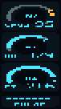

# Serial Framebuffer Trace Protocol

The ESP32 firmware can emit a low-resolution snapshot of the display over the serial port. This allows an LLM (or any automated tool) to **see** the screen contents without a camera, enabling a closed-loop edit → flash → inspect workflow.



## Hardware gate

Trace emission is **gated by GPIO7**. The pin has an internal pull-up, so it defaults to HIGH (off). **Ground GPIO7 to enable trace output.** Remove the jumper to disable it with zero firmware changes.

When the gate state changes, the firmware emits:

```
FBTRACE gpio=7 state=ON
FBTRACE gpio=7 state=OFF
```

## Protocol overview

- **Baud rate:** 115200
- **Frame interval:** 300 ms (throttled)
- **Resolution:** 38 × 68 pixels (downsampled from the 76 × 284 TFT)
- **Encoding:** 4 bits per pixel, nibble-packed (high nibble first), base64 encoded
- **Payload size:** ~1724 base64 chars per frame

### Line format

When trace is first enabled, a metadata banner is emitted:

```
FBMETA v3 gpio=7 active=LOW w=38 h=68 fmt=b64_4bpp
```

Each frame is a single line:

```
FB <seq> <base64_payload>
```

Where:
- `<seq>` is a monotonically increasing frame counter
- `<base64_payload>` is the nibble-packed pixel data (2 pixels per byte, base64 encoded)

### Palette

Each pixel is a 4-bit index into a fixed 9-color palette:

| Index | Name   | RGB          | Description                   |
|------:|--------|--------------|-------------------------------|
|     0 | black  | `#04090F`    | Screen background             |
|     1 | bg     | `#09141D`    | Panel/card background         |
|     2 | dim    | `#5A6E78`    | Gauge track, dim text         |
|     3 | white  | `#F2FBFF`    | Bright text, needle           |
|     4 | cyan   | `#4DE8FF`    | SpO2 accent                   |
|     5 | green  | `#95FF5A`    | HR accent, signal bars        |
|     6 | amber  | `#FFC04D`    | PI accent                     |
|     7 | red    | `#D81F2E`    | Alert / out-of-range          |
|     8 | yellow | `#F8FFA0`    | Peak hold marker              |

### Decoding a frame

```python
import base64

def decode_4bpp(payload: str, w: int = 38, h: int = 68) -> list[int]:
    raw = base64.b64decode(payload)
    pixels = []
    for i in range(w * h):
        byte = raw[i >> 1]
        pixels.append((byte >> 4) & 0xF if i % 2 == 0 else byte & 0xF)
    return pixels
```

## Tools

All tools live in `tmp/` and run under the project venv.

### `tmp/decode_pulseox_fb_trace.py`

Offline decoder. Reads a log file (or stdin) and prints ASCII art frames.

```bash
python tmp/decode_pulseox_fb_trace.py tmp/pulseox_fb_trace.log --last-only
```

### `tmp/live_pulseox_fb_review.py`

Live serial monitor. Connects to the device, logs raw lines to `tmp/pulseox_fb_trace.log`, and redraws decoded frames in the terminal.

```bash
python tmp/live_pulseox_fb_review.py --port /dev/cu.usbmodem1101
```

### `tmp/trace_to_gif.py`

Renders a trace log into an animated GIF with actual display colors.

```bash
python tmp/trace_to_gif.py tmp/pulseox_fb_trace.log -o esp32/docs/pulseox-demo.gif --scale 2 --fps 3
```

## LLM development loop

This protocol was designed so an LLM agent can autonomously inspect its own UI changes. Here is the recommended workflow:

### 1. Capture a trace

After flashing new firmware, start the live monitor in the background:

```bash
python tmp/live_pulseox_fb_review.py --port /dev/cu.usbmodem1101 > /dev/null 2>&1 &
```

Wait 10–15 seconds for frames to accumulate in `tmp/pulseox_fb_trace.log`, then kill the background process.

### 2. Decode the last frame

```bash
python tmp/decode_pulseox_fb_trace.py tmp/pulseox_fb_trace.log --last-only
```

This produces an ASCII rendering using palette-mapped characters:

```
 .:##CGA RY
 │││││││ ││
 │││││││ │└─ yellow (peak marker)
 │││││││ └── (unused)
 ││││││└──── amber (PI accent)
 │││││└───── green (HR accent)
 ││││└────── cyan (SpO2 accent)
 │││└─────── white (bright text)
 ││└──────── dim (gauge track)
 │└───────── bg (panel background)
 └────────── black (screen background)
```

### 3. Evaluate the layout

Look for:
- **Text clipping:** label characters touching card edges or overlapping arc pixels
- **Arc bleed:** trail/accent color pixels intruding into the text zones at the bottom corners
- **Spacing:** consistent gaps between cards, centered elements, symmetry
- **Pulse bar:** dots should appear as small clusters, centered in the bottom panel

### 4. Iterate

If the layout needs changes:
1. Edit `esp32/src/pulseox_demo_lvgl.cpp`
2. Build and flash: `pio run -e esp32-s3-n16r8 -t upload --upload-port /dev/cu.usbmodem1101`
3. Capture another trace and decode
4. Repeat until the ASCII rendering shows clean separation between all UI elements

### Tips for LLM agents

- The log file is **truncated on each capture run** — no need to delete it first.
- GPIO7 must be grounded or the device emits no trace data.
- The 38×68 resolution is enough to verify element placement and overlap, but individual small characters may be hard to distinguish.
- Focus on structural layout (arc boundaries, text block positions, card edges) rather than trying to read specific digit values.
- When making gauge layout changes, the key areas to watch are the bottom-left (label) and bottom-right (value) corners of each card — these are where arc-to-text overlap is most likely.
